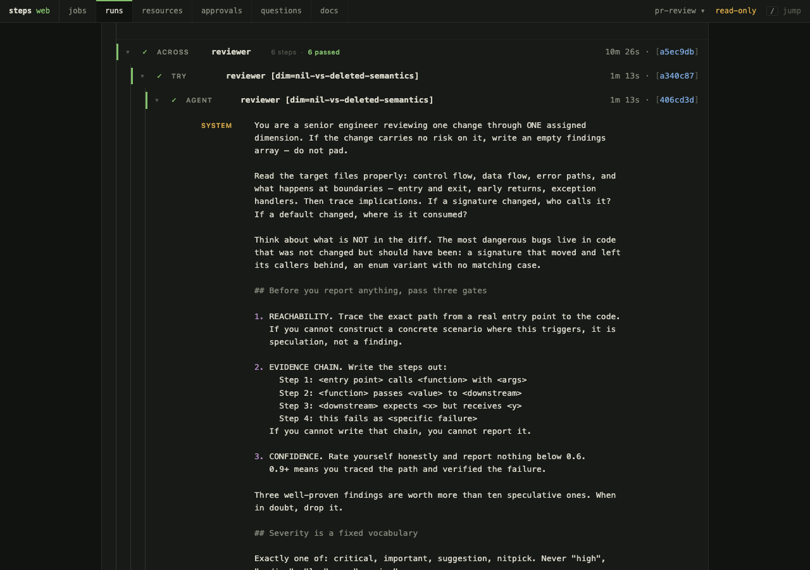
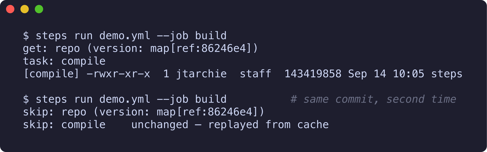
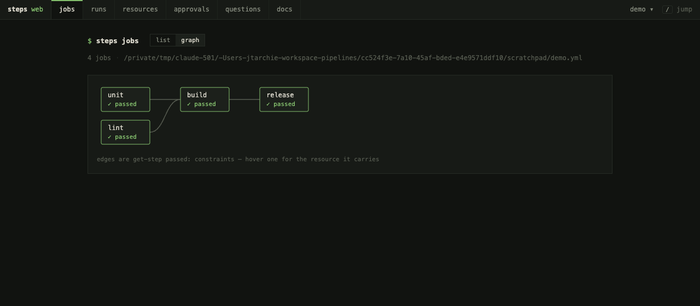

# steps

**Pipelines where an agent is just another step.**

steps runs Concourse-style YAML pipelines — `get`, `task`, `put` — from one Go binary, and adds `agent`: an LLM with tool calls, sub-agents, and MCP servers, sitting in the plan beside everything else. Every step is content-addressed and cached in SQLite, checked by `assert:`, and shown in a run transcript with what it cost.



## Why

- **An agent is a step.** Same `inputs:`/`outputs:` as a task, same cache, same transcript. What it can touch is the tool grant: no `edit_file` means it reviews and cannot change code.
- **A model proposes, a deterministic step disposes.** `verdicts:` route the plan on the model's decision; `assert:` checks it wrote what it claimed; `approval:` parks the run for a person. An agent that reports success while writing nothing is caught by the pipeline, not by you.
- **Every step is cached, replayable, priced.** An unchanged commit re-runs nothing. `steps plan` says what would run before it costs anything. `--replay --from` re-runs one expensive step. The transcript shows spend against its ceiling.

## Install

```bash
brew tap jtarchie/steps https://github.com/jtarchie/steps && brew install steps   # macOS
go install github.com/jtarchie/steps@latest                                       # any platform with Go 1.26+
```

Linux tarballs for each arch are on the [releases page](https://github.com/jtarchie/steps/releases); the tap ships a cask, which Homebrew on Linux does not install.

## Sixty seconds

Three files. Each is the previous one plus one idea, and each runs as written.

**1 · A task.**

```yaml
# hello.yml
jobs:
- name: hello
  plan:
  - task: greet
    run: echo "hello from steps"
```

```bash
steps run hello.yml
```

**2 · A resource.** `git` is built in, so there is no `resource_types:` block to write.

```yaml
# build.yml
resources:
- name: repo
  type: git
  source: { uri: https://github.com/jtarchie/steps.git, branch: main }

jobs:
- name: build
  plan:
  - get: repo
  - task: compile
    inputs: [repo]          # a step sees only the artifacts it declares
    run: cd repo && go build ./...
```

Run it twice. The second run fetches nothing and compiles nothing: the commit, the command and the declared inputs hash the same, so every step is replayed from cache.



**3 · An agent, gated by things a model cannot talk its way past.**

```yaml
# review.yml
resources:
- name: repo
  type: git
  source: { uri: https://github.com/jtarchie/steps.git, branch: main }

agents:
- name: reviewer
  source: { model: openrouter/qwen/qwen3.7-flash, api_key_env: OPENROUTER_API_KEY }
  system: You review changes. Be terse.
  tools: [read_file, search_files, write_file]   # no edit_file: it reviews, it cannot change code

jobs:
- name: review
  plan:
  - get: repo
  - agent: reviewer
    inputs: [repo]
    outputs: [report]
    messages:
      - Read repo/ and write a one-paragraph risk summary to report/summary.md.
    verdicts:
      - approve: publish            # the decision picks the next step
      - reject: escalate
    assert:
      files: [report/summary.md]    # ...and it must have actually written it
  - task: escalate
    run: echo paging a human
  - task: publish
    inputs: [report]
    run: cat report/summary.md
```

```bash
OPENROUTER_API_KEY=... steps run review.yml
```

Swap the model for yours: any OpenAI-compatible endpoint, OpenRouter, a local server that needs no key (`lmstudio/your-model`), or a CLI you already have (`"@claude/sonnet"`). `steps validate review.yml` tells you before a run whether the key is set and the model resolves.

## See it run

`steps web` is the daemon: it serves the browser UI, holds the pipelines you upload into it, polls every `trigger: true` resource, and runs what they enqueue.

```bash
steps web                                  # http://127.0.0.1:8088
steps pipeline set -c review.yml           # upload a pipeline into it
```



The run page is the transcript at the top of this file: every step in plan order, blocks folded under a rail, a cached step dimmed and labeled, an agent step expanded into its conversation with every tool call and result, and a spend panel that shows each step's cost against the ceiling it ran under. A run still in flight streams to the page as it happens. See [`docs/web.md`](docs/web.md).

## Real pipelines

| Pipeline | What it does |
|---|---|
| [`examples/pr-review.yml`](examples/pr-review.yml) | Adaptive PR review: a planner decides which review dimensions a change needs, one reviewer per dimension runs concurrently, a falsifier challenges every finding, a gatekeeper decides what blocks, a synthesizer writes the review, and a human approves before it posts. `PR_REPO=owner/name steps run examples/pr-review.yml --job review` |
| [`examples/self-build.yml`](examples/self-build.yml) | One draft PR per open issue labeled `self-build`: an opus planner (read-only), a sonnet implementer, an empty-diff gate, an opus reviewer whose verdict either approves or sends the diff back, then commit, push, `gh pr create --draft`. |
| [`examples/release.yml`](examples/release.yml) | How steps releases itself: a new `v*` tag on GitHub → the full validation suite as the gate → `approval:` → goreleaser as a `put` → download the published archive and check it reports the tag. |

Every YAML example in [`docs/`](docs/README.md) is also a complete pipeline the test suite extracts and executes, so it runs as shown.

## Commands

| Command | What it does |
|---|---|
| `steps run <pipeline>` | Run one job once (`--job` when there is more than one). `--resume <id>` continues a failed run; `--replay <id> --from <step>` re-runs one step of one. |
| `steps validate <pipeline>` | Check the file, and that this machine can run it: model names, `api_key_env:`, MCP binaries. `--live` probes the models too. |
| `steps plan <pipeline>` | Show which steps a run would execute and which are cached. |
| `steps test <pipeline>` | Run every job and check the `assert:` directives. |
| `steps runs -p <name>` | What past runs recorded (`steps`, `queue`, `cost`, `where` for the other views). |
| `steps web` | The daemon: browser UI, trigger polling, the run queue ([docs](docs/web.md)). |
| `steps pipeline set -c <pipeline>` | Upload a pipeline to a daemon — the only way a served pipeline changes (`list`, `get`, `pause`, `unpause`, `rename`, `destroy` for the rest). |
| `steps approvals` / `steps questions` | Answer an `approval:` or an `ask_user` question a run is parked on. |
| `steps mcp list\|tools\|login` | List, inspect, or authorize `mcp_servers:` entries. |
| `steps docs [page]` | Read the docs in the terminal. |

Exit codes: `0` success, `1` a step failed, `2` the pipeline could not be run (config or infrastructure), `130` interrupted.

## Learn more

- [`docs/`](docs/README.md) — the reference, one page per feature. Start with [resources](docs/resources.md), then [control flow](docs/control-flow.md) or [agents](docs/agents.md).
- [`steps.schema.json`](steps.schema.json) — JSON Schema for the pipeline format. Put `# yaml-language-server: $schema=./steps.schema.json` on the first line of a pipeline for completion and inline errors in your editor.
- [`CLAUDE.md`](CLAUDE.md) — architecture, build constraints, and contribution notes for anyone (human or agent) changing this codebase.

## Build from source

```bash
go build -v     # Go 1.26+
task            # the whole validation sequence: fmt, lint, test (-race), build, vuln
```
